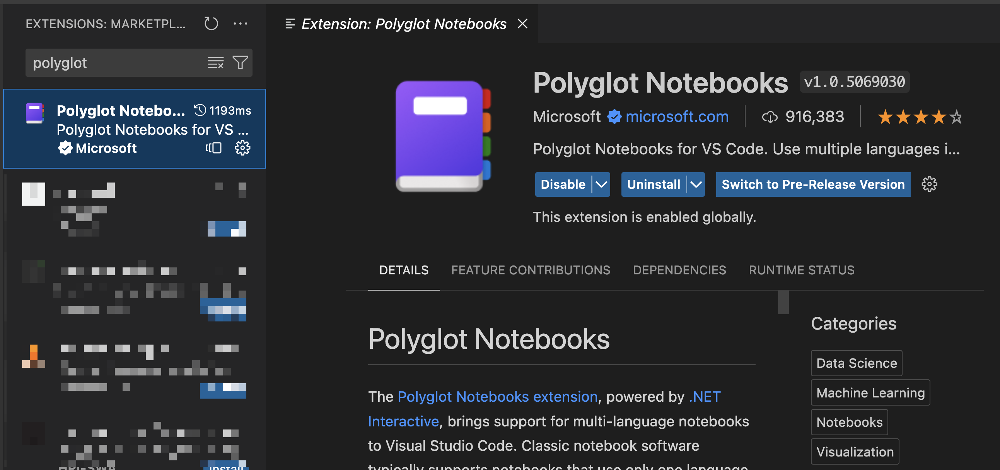
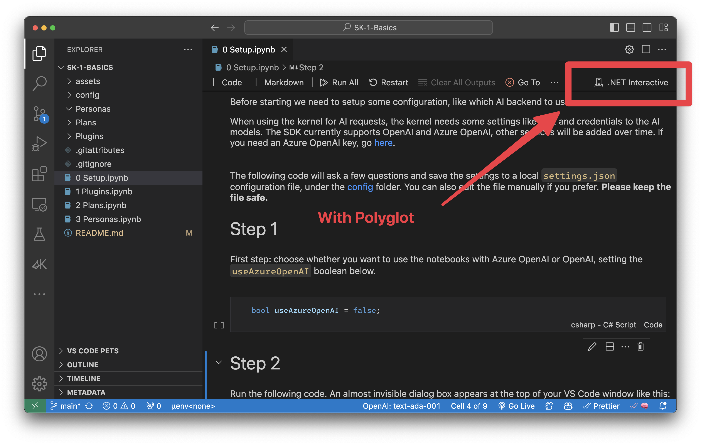

# Hello!

Visit the [Semantic Kernel repo](https://github.com/microsoft/semantic-kernel) to learn more about what this is all about :+).

---

Again, hi there! To get started with this repo, you'll need to:

1. Have VS Code running on your machine
2. Get the Polyglot Notebook extension running in VS Code

3. Install Dotnet 8
4. Clone or fork this repo
5. Have your OAI or AOAI key ready to input in step 2 of `0 Setup.ipynb`
6. When running the notebooks, select `.NET Interactive` for your VS Code Notebook kernel

⚠️ Don't forget: Python != C#/.NET :+) Polyglot Notebook extension lets C#/.NET magically run Python-style notebooks. IMHO it's really cool!